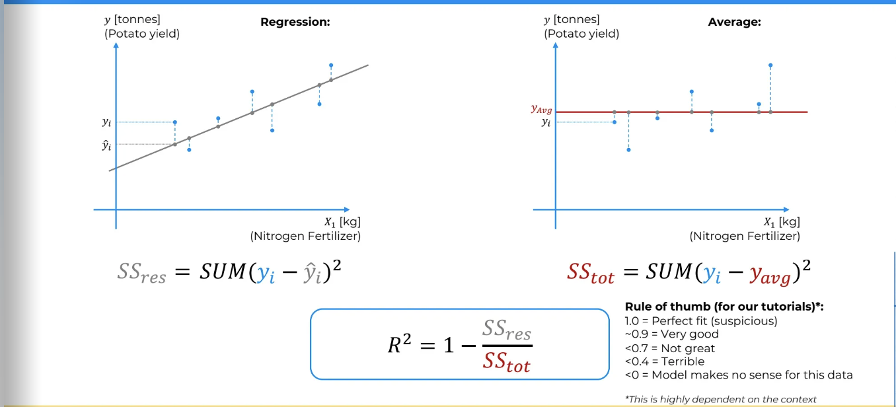

# General Notes

## R squared

R squared is a measure of how well the independent variables explain the variance of the dependent variable. It is a value between 0 and 1. The closer to 1, the better the model explains the variance.



**formula**

```python
R^2 = 1 - (SSR/SST)
```

where SSR is the sum of squared residuals and SST is the total sum of squares,
SST is the sum of the squared differences between the actual y values and the mean of y.

```py
SSR = sum((y - y_hat)^2)
SST = sum((y - y_mean)^2)
```

y_hat is the predicted value of y.
y_mean is the mean of y.

Rules of thumb for R squared:

- 1 is perfect fit (suspicious)
- ~0.9 is very good
- ~0.8 is good
- ~0.7 is decent
- <0.7 is not great
- <0.4 terrible
- <0 is worse than just using the mean of y

## R squared adjusted

R squared adjusted is a modified version of R squared that adjusts for the number of predictors in the model. It is always lower than R squared.

**formula**

```python

R^2_adj = 1 - ((1 - R^2) * (n - 1) / (n - p - 1))

```

where n is the number of observations;
p is the number of predictors (independent variables);
R is the previous R squared value.
